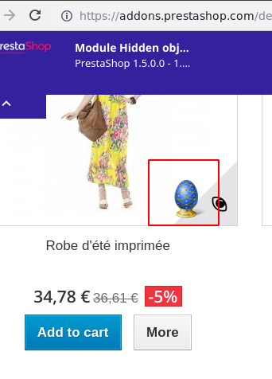
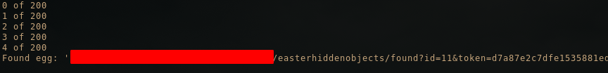
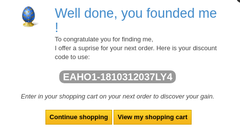

# prestashop-bot

PrestaShop is a e-commerce solution. There are three modules (described below) that will put hidden objects on the shop that the user can find. For each finding the user will be rewarded with a coupon that can be a free item or a discount.

My goal was to automate the process and remove the human part of the equation.




## Supported modules
* [Hidden objects game : Easter	Module](https://addons.prestashop.com/en/contests/22041-hidden-objects-game-easter.html)
* [Hidden objects game : Christmas Module](https://addons.prestashop.com/en/contests/20718-hidden-objects-game-christmas.html)
* [Hidden objects game : New Year Module](https://addons.prestashop.com/en/contests/20866-hidden-objects-game-new-year.html)

## Examples

```bash
$ python prestabot.py https://example-domain-here.com
```



Then just open the link in the browser to grab that well earned coupon:




##### Warning! Never use this tool on a website that you do not have permission to use it on. This tool is only for testing purposes of the modules.